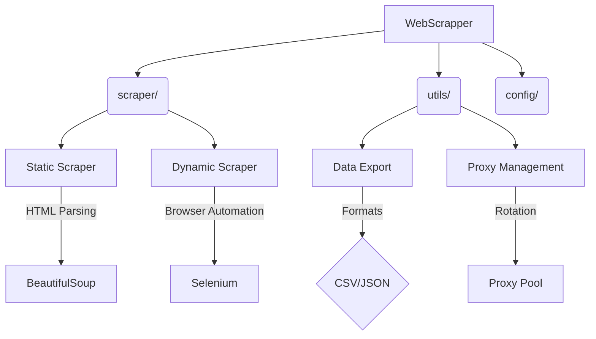

# 🌐 WebScraper Suite

<details>
<summary>🧭 <strong>Quick Navigation</strong></summary>

▸ [🚀 Features](#-features)  
▸ [💡 Usage Examples](#-usage-examples)  
▸ [🖥️ Interactive CLI](#-interactive-cli)  
▸ [🏗️ Project Structure](#-project-architecture)  
▸ [⚙️ Installation](#-installation)  
</details>

## 🚀 Features

<details>
<summary>🛠️ <strong>Core Features</strong> <i>(click to expand)</i></summary>

🕸️ **Scraping Engine**  
⚡ Multi-threaded architecture  
🎯 Dual CSS/XPath selector support  
🔁 Auto-retry with exponential backoff  
⏱️ Smart rate limiting (requests/min)

🛡️ **Security**  
🌍 Proxy rotation (HTTP/SOCKS5)  
🎭 Request header randomization  
🔒 TLS fingerprint rotation  
🍪 Cookie management
</details>

<details>
<summary>💾 <strong>Data Handling</strong> <i>(click to expand)</i></summary>

📦 **Export Formats**  
📝 CSV/JSON  
🧹 Clean, readable JSON with paragraph splitting  
🔄 Automatic file rotation  
🗂️ Metadata preservation  
📚 Batch processing
</details>

<details>
<summary>🤖 <strong>Advanced Features</strong> <i>(click to expand)</i></summary>

🌐 **Browser Automation**  
🦾 Selenium-based dynamic scraping  
👻 Headless Chrome/Firefox  
🧑‍💻 Playwright-ready architecture

🧠 **AI/UX Enhancements**  
✨ Smart "auto" content detection  
🎨 Minimal, modern, interactive CLI (with [rich](https://github.com/Textualize/rich))  
🔀 Dynamic example URLs and selector hints  
📊 Session summary and progress feedback
</details>

---

## 💡 Usage Examples

```bash
# Basic scraping with CSS selector
python main.py -u https://example.com -s '{"title": "h1"}' -f json

# Interactive mode (recommended for new users)
python main.py --interactive

# Dynamic (JavaScript) scraping
python main.py -u https://react-app.example.com -s '{"main": "main"}' -d

# Using a selectors file
python main.py -u https://example.com -s selectors.json -o results -f csv
```

---

## 🖥️ Interactive CLI

The interactive CLI is designed for a modern, minimal, and smart user experience:

- 🌍 **Dynamic example URLs**: Get new, relevant examples every run.
- 🧩 **Selector hints**: See real-world selector examples as you type.
- 🧘 **No clutter**: Only the session summary and export path are shown, not the full scraped data.
- ⏳ **Progress feedback**: Spinners and clear status messages.
- 📋 **Session summary**: See URL, export path, and time taken at the end.

**Sample session:**
```
┌─────────────────────────────────────────────┐
│         Web Scraper Interactive Mode        │
└─────────────────────────────────────────────┘
Tip: Press Ctrl+C at any time to exit.

Examples: https://www.bbc.com/news, https://www.amazon.com/, https://www.wikipedia.org/
🔗 Enter URL to scrape [default: https://www.amazon.com/]: 
✨ Use dynamic scraper for JavaScript content? [Y/n]: 
Enter CSS selectors (key=selector, one per line, empty line to finish)
Or type 'auto' to use automatic content detection
Examples: title=h1, paragraphs=p, links=a, auto
Selector [default: auto]: auto

📦 Export format [json/csv] (default: json): 
💾 Output filename (without extension) [default: scrape_result_1680000000]: 

🚀 Scraping https://www.amazon.com/...

✅ Data exported to: exports/scrape_result_1680000000.json

Session Summary
URL:      https://www.amazon.com/
Exported: exports/scrape_result_1680000000.json
Time taken: 3.21 seconds
```

---

## 🏗️ Project Architecture



---

## ⚙️ Installation

```bash
pip install -r requirements.txt
# For best CLI experience, also install:
pip install rich
```

---

## 💡 Tips

- Use `--interactive` for a guided, user-friendly scraping session.
- Use "auto" as a selector for smart, automatic content extraction.
- All exports are saved in the `exports/` directory by default.

---

## 📄 License

MIT

---

*Made with 🕸️, 🤖, and a love for modern web scraping.*