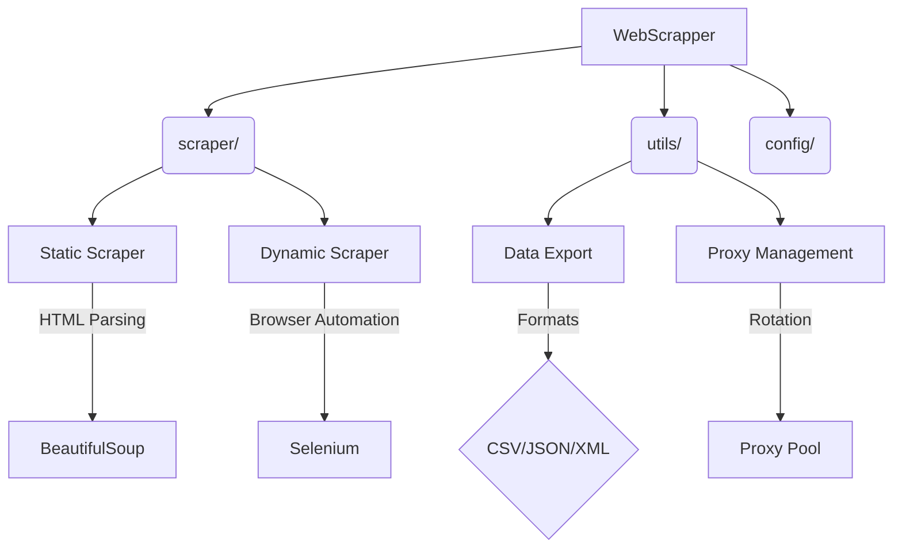

# 🕷️ Web Scraper Suite


<details>
<summary>🚀 <strong>Quick Navigation</strong></summary>

▸ [Features](#-features)  
▸ [Usage Examples](#-usage-examples)  
▸ [Project Structure](#-project-architecture)  
</details>

## 🌟 Features

<details>
<summary>🔧 <strong>Core Features</strong> <i>(click to expand)</i></summary>

🎯 **Scraping Engine**  
✔️ Multi-threaded architecture  
✔️ Dual CSS/XPath selector support  
✔️ Auto-retry with exponential backoff  
✔️ Smart rate limiting (requests/min)

🛡️ **Security**  
✔️ Proxy rotation (HTTP/SOCKS5)  
✔️ Request header randomization  
✔️ TLS fingerprint rotation  
✔️ Cookie management
</details>

<details>
<summary>💾 <strong>Data Handling</strong> <i>(click to expand)</i></summary>

📦 **Export Formats**  
✔️ CSV/JSON/XML/YAML  
✔️ SQLite database support  
✔️ Elasticsearch integration

⚡ **Optimizations**  
✔️ GZip compression  
✔️ Automatic file rotation  
✔️ Metadata preservation  
✔️ Batch processing
</details>

<details>
<summary>🚄 <strong>Advanced Features</strong> <i>(click to expand)</i></summary>

🌐 **Browser Automation**  
✔️ Selenium integration  
✔️ Headless Chrome/Firefox  
✔️ Puppeteer-style API

🤖 **AI Enhancements**  
✔️ CAPTCHA solving framework  
✔️ Content validation pipelines  
✔️ Dynamic selector generation
</details>


## 🖥️ Usage Examples

```bash
# Basic scraping with CSS selector (with progress display)
webscrapper --url https://example.com \
  --selector 'div.content' \
  --format json \
  --progress

# Advanced scraping with proxy rotation
webscrapper --url https://api.example.com/data \
  --proxy-file proxies.txt \
  --output results/ \
  --format parquet \
  --concurrency 8

# Browser-based scraping with screenshots
webscrapper --url https://react-app.example.com \
  --engine chrome \
  --interactive \
  --screenshots
```

## 🏗️ Project Architecture

